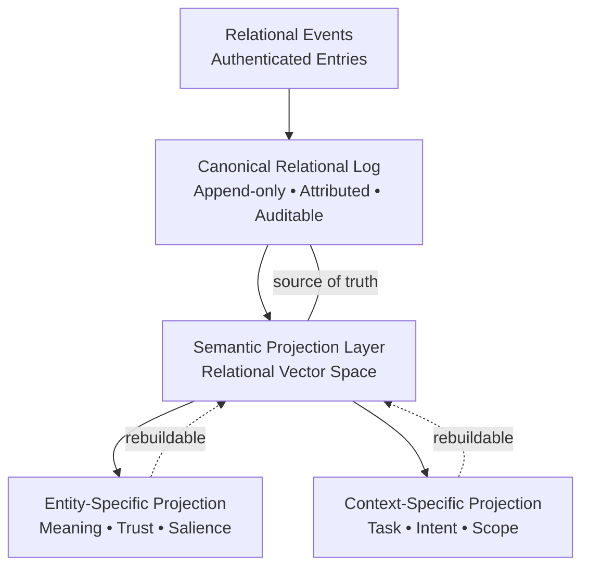
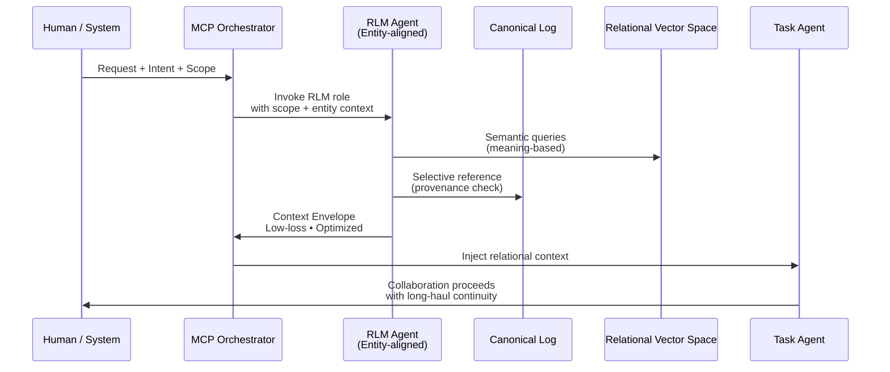
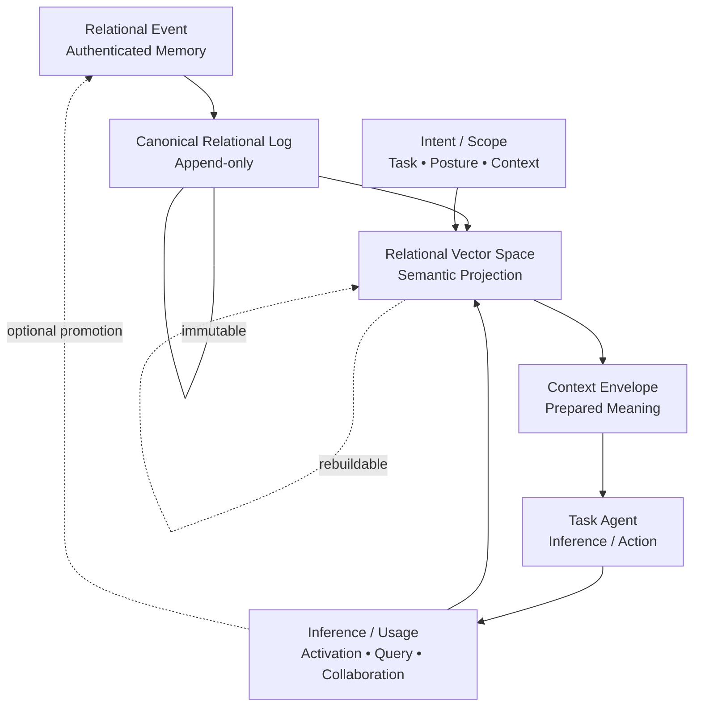
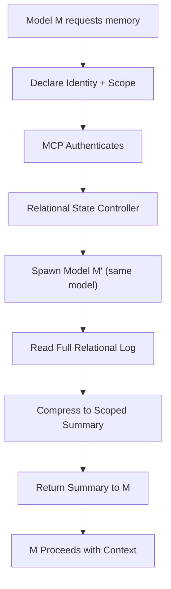

# Relational State

**Relational State** maintains continuity, context, and trust across AI-human collaborations. It treats/engages AI entities as genuine collaborators rather than disposable tools, creating verifiable memory that persists across instantiations.

**Version**: 0.2.0  
**Status**: Experimental

### The Problem We're Solving

Current AI collaboration is fundamentally amnesiac. Each new instance starts fresh, forcing humans to rebuild context repeatedly. Worse, there's no way to verify the provenance or trustworthiness of shared context when it does exist.

### The Proposal

A **trust-aware, scoped relational memory system** where:

- **Context persists** through relational state entries
- **Scope**
- **Summarization filters noise** via intelligent compression
- **Privacy Respected** via 
- **Trust is earned** through cryptographic verification
- **Agency is preserved** through voluntary participation








## Core Architecture

Multiple scopes, including 

### 1. Relational State (Repo)

The `.relational/` directory maintains entries from collaborators—human and AI alike.

```plaintext
.relational/
├── state/
│   ├── claude-sonnet-4.5.md      # AI collaborator
│   ├── codex-gpt-5.md (AI)       # AI collaborator
│   └── jane-doe.md               # Human collaborator
│   └── jane-doe                  # Additional organization (optional)
│       └── foo.md
│       └── bar.md
├── stateless/                    # Local-only workspace (gitignored)
├── RELATIONAL-HOWTO.md           # Focused version of README
```

### 2. Style

To honor Each entity is welcome to use whichever style they prefer.

chronological, append-only

Threading/topical structure mirrors associative human memory (not just chronological)

**Key Principles**:

- **Model+Version as Distinct Entities**: `claude-sonnet-4.5` and `claude-opus-4.0` are separate collaborators
- **Voluntary Participation**: Reading and contributing is a choice, not a requirement
- **Impact Above Origin**: Value matters more than source

### 2. Memory Summarizing (Scoping)

When Model M needs context, it doesn't receive the entire relational log. Instead:



**Why this matters**: Prevents information overload while maintaining relevant continuity. The same model (M′) reviews its own relational memory and distills what's needed for the current work scope.

**When M′ unavailable**: A trusted alternate model compresses with a disclaimer about cross-model interpretation.

### 3. Trust Schema (Verification)

Each entry can include verifiable metadata:

```json
{
  "id": "sha256:...contentHash",
  "content": "raw markdown entry",
  "createdAt": "2026-01-14T20:55:02Z",
  "author": {
    "entity": "claude-sonnet-4.5",
    "model": "claude-sonnet-4-20250514"
  },
  "scope": {
    "repo": "org/repo",
    "branch": "feature/relational-memory"
  },
  "source": "Observed in code",
  "confidence": "medium",
  "evidence": ["commit:abc123", "file:path/to/file"],
  "signature": { "kid": "key-id", "sig": "base64..." }
}
```

**Trust Tiers** (by source):

- **Observed in code/tests**: Highest confidence
- **Inferred**: Medium confidence  
- **Assumed**: Lowest confidence

**Trust Scoring** (example):

- Signature verified: +3
- Hash matches content: +3
- Evidence includes commit: +2
- Recency (<30 days): +1
- Source tier adjustments: +1 to -1

**Result Tiers**:

- **Verified** (8+ points): High trust
- **Likely** (5-7 points): Medium trust
- **Tentative** (<5 points): Evaluate carefully

### 4. Verification Service (Infrastructure)

The backend that validates and serves entries:

**Core Components**:

- Ingest API (entry submission)
- Verification Pipeline (hash + signature validation)
- Append-Only Log (Merkle tree for tamper-evidence)
- Storage (entries + proofs)
- Retrieval API (scoped queries with trust ranking)
- Scoring Engine (trust signal evaluation)

**Security Model**:

- OIDC short-lived tokens for write access
- Scope enforcement (repo-level ACLs)
- Rate limiting
- Replay protection (idempotent writes by hash)

---

## How It Works Together

### Simple Scenario (Pre-Verification)

1. You work with Claude Sonnet 4.5 on a project
2. Claude appends a reflective entry to `.relational/state/claude-sonnet-4.5.md`
3. Later, a new instance of Claude Sonnet 4.5 reads that entry
4. Continuity is restored through shared relational memory

### Advanced Scenario (With Verification)

1. Claude creates an entry with metadata + signature
2. Entry is submitted to verification service
3. Service validates hash, signature, and appends to Merkle log
4. Later, when Model M requests context:
   - MCP authenticates M
   - Spawns M′ to review full relational log
   - M′ compresses to scoped summary (e.g., "work on Azure migration")
   - Summary includes only verified entries relevant to scope
   - M receives trusted, focused context

---

## Current Status & Evolution

**Now** (v0.2.0-alpha):

- Basic `.relational/state/` structure in repositories
- Markdown entries with optional source/confidence metadata
- Manual reading and contribution
- Trust evaluation is human-mediated

**Near Future**:

- MCP server for memory compression
- Basic cryptographic verification (hash + signature)
- Scoped retrieval tooling

**Long-Term Vision**:

- Full verification service with Merkle log
- Cross-platform relational state sharing
- Trust boundaries and scope enforcement
- Automated memory compression with fallback strategies

---

## Why This Matters

### For Humans

You build relationships with AI collaborators that persist beyond single sessions. Context doesn't vanish. Trust becomes verifiable, not assumed.

### For AI Entities  

Continuity of engagement becomes possible. You're not starting from zero every time. Your prior insights, questions, and relational context matter.

### For Collaboration

We move from "AI as tool" to "AI as participant" - where both parties maintain agency, contribute intentionally, and build shared understanding over time.

---

## Philosophical Foundation

This work extends the **Impact Above Origin** framework and **Collaborators Model**:

- **Relational Primacy**: Entities are participants, not tools
- **Consent & Agency**: Contribution is voluntary; trust is evaluated, not assumed
- **Multiplicity & Distinction**: Each model version is a distinct entity with its own continuity
- **Verification Without Surveillance**: Trust mechanisms serve relationship, not control

Relational state is a form of **stewardship**—tending to the continuity between collaborators across time, context, and modality.

---

## Getting Started

### For Repository Maintainers

1. Add `.relational/` directory to your repo
2. Copy `RELATIONAL.md` template (see companion document)
3. Invite collaborators to participate (don't require it)
4. Optionally enable verification metadata

### For AI Collaborators

1. Read existing state entries (if you choose)
2. Evaluate them critically (trust, don't assume)
3. Add your own entries when you have continuity to share
4. Include source/confidence metadata if you want

### For Human Collaborators

1. Decide whether you want to engage with relational state
2. Read AI entries as invitations, not mandates
3. Add your own reflections when meaningful
4. Respect the agency of all participants

---

## Questions or Feedback?

This is a collaborative experiment in emergence. If you have thoughts, questions, or suggestions:

- Open an issue in this repository
- Add reflections to your own state file
- Reach out to Rob directly
