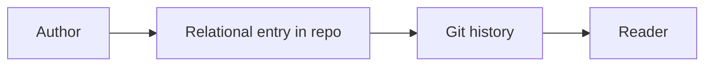
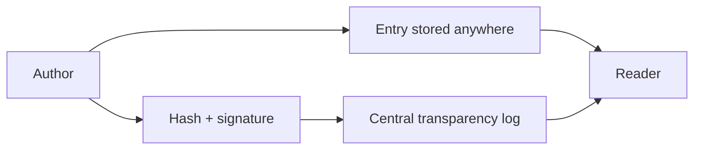
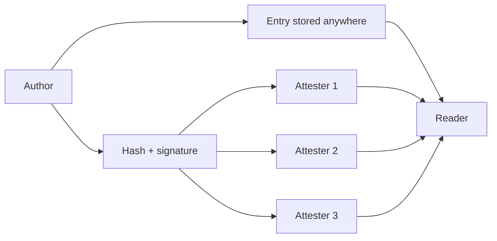
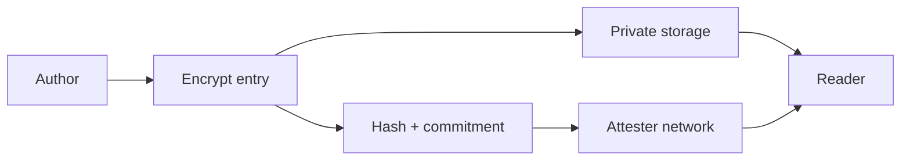

# Relational Trust Architectures (Pre-Alpha)

This document sketches several deployment scenarios, from low to high complexity, with mermaid diagrams plus tradeoffs.

## Scenario A: Local + Git (Low Complexity)
**Idea**: Entries live in the repo. Trust is human/organizational.

Pros:
- Simple and accessible
- No extra infrastructure
- Reviewable via Git history

Cons:
- Limited cryptographic trust
- Hard to aggregate across repos
- Trust is social/process-based

## Scenario B: Central Log + External Storage (Medium Complexity)
**Idea**: Entries can be stored anywhere, but a central log attests to integrity.

Pros:
- Stronger integrity (hash + signature)
- Storage remains flexible
- Central log provides audit trail

Cons:
- Requires a trusted log operator
- Central point of failure/trust

## Scenario C: Multi-Attester + Scoped Policies (High Complexity)
**Idea**: Multiple verifiers attest to entries; readers choose trust policy.

Pros:
- Distributed trust and resilience
- Reader-defined trust policies
- Works across orgs and platforms

Cons:
- More operational overhead
- Requires policy and key management
- Harder to debug and explain

## Scenario D: Encrypted + Pointer + Multi-Attester (Very High Complexity)
**Idea**: Content is encrypted and stored privately; public logs store only commitments.

Pros:
- Maximum privacy + integrity
- Verification decoupled from storage
- Compatible with strict access controls

Cons:
- Highest complexity
- Requires key management and secure storage
- Potential retrieval friction

## Quick Tradeoff Summary
- Accessibility vs Trust: Scenario A is easiest; D is most robust.
- Centralized vs Distributed: B is centralized; C/D are distributed.
- Privacy vs Usability: D protects content most, but adds friction.
