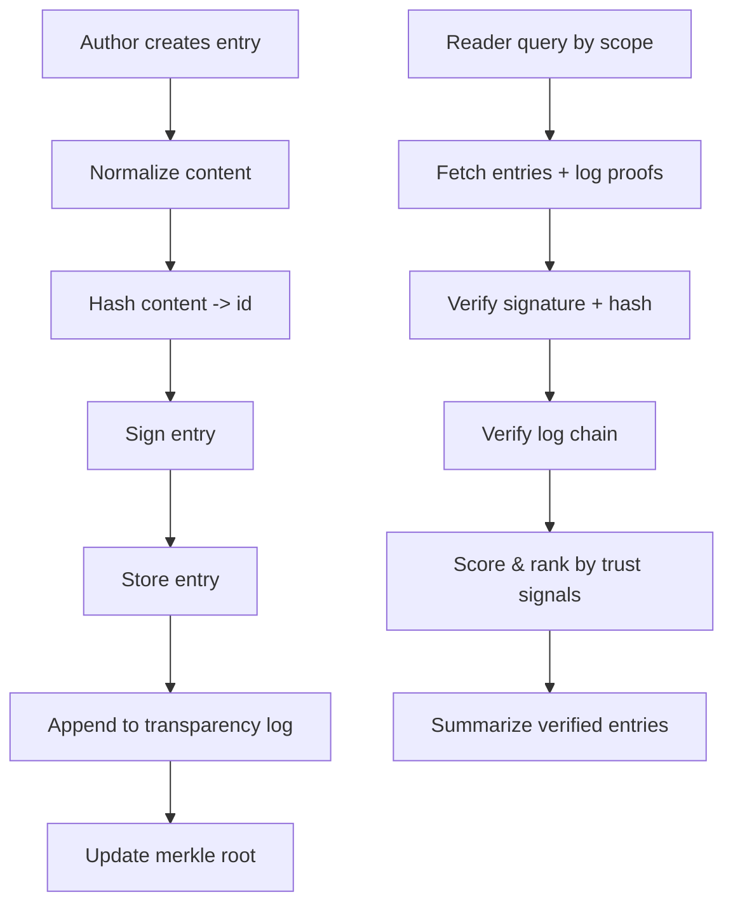

# Relational Trust Sketch (Pre-Alpha)

This document outlines a minimal, verifiable relational-state format and a trust/verification strategy that stays light but extensible.

## Goals
- Integrity: tamper-evident entries (hash + signature)
- Provenance: who/what created it (model, toolchain, scope)
- Trust cues: explicit source + confidence signals
- Retrieval: scoped lookup with transparent ranking

## Entry Schema (Minimal)
```json
{
  "id": "sha256:...contentHash",
  "uuid": "6f6c...-...",
  "content": "raw markdown",
  "summary": "optional summary",
  "createdAt": "2026-01-14T20:55:02Z",
  "author": {
    "entity": "Codex (OpenAI)",
    "model": "gpt-5",
    "toolchain": "codex-cli@X.Y.Z"
  },
  "scope": {
    "repo": "org/repo",
    "issue": 44,
    "branch": "feature/foo"
  },
  "source": "Observed in code",
  "confidence": "medium",
  "evidence": [
    "commit:abc123",
    "file:components/Playfield/HelloWorldBanner.tsx"
  ],
  "signature": { "kid": "sigstore:key-id", "sig": "base64..." },
  "log": { "prev": "sha256:prev", "root": "sha256:merkleRoot" }
}
```

## Trust Tiers (Source)
- Observed in code/tests: highest
- Inferred: mid
- Assumed: lowest

## Confidence (Self-reported)
- low, medium, high

## Simple Scoring (Example)
Start at 0, then:
- +3: signature verified
- +3: hash matches content
- +2: transparency log proof verified
- +2: evidence includes commit hash
- +1: evidence includes file path
- +1: recency < 30 days
- +1: source = Observed in code/tests
- +0: source = Inferred
- -1: source = Assumed

Thresholds (example):
- 8+: Verified
- 5-7: Likely
- <5: Tentative

## Retrieval Strategy
1. Query by scope (repo/issue/branch) + date window.
2. Verify signature + hash.
3. Verify append-only log proof.
4. Rank by score.
5. Summarize verified entries; optionally include tentative in a separate section.

## Mermaid Flow


## Encrypted or Pointer Entries (Optional)
You can decouple verification from content by storing only hashes/commitments in the public log.

Encrypted entry (ciphertext stored anywhere):
```json
{
  "id": "sha256:...ciphertextHash",
  "ciphertextRef": "s3://bucket/object",
  "plaintextCommitment": "sha256:...normalizedPlaintext",
  "signature": { "kid": "sigstore:key-id", "sig": "base64..." }
}
```

Pointer entry (content stored privately):
```json
{
  "id": "sha256:...contentHash",
  "locator": "vault://secret/path",
  "plaintextCommitment": "sha256:...normalizedPlaintext",
  "signature": { "kid": "sigstore:key-id", "sig": "base64..." }
}
```

Notes:
- Hashing ciphertext proves integrity of what was stored; a plaintext commitment lets you verify after decryption.
- Multiple attesters can vouch for the same commitment without seeing plaintext.

## Notes
- UUID is for retrieval; hash is for integrity.
- OIDC-backed short-lived tokens are ideal for write auth.
- This is intentionally minimal; extend with redaction, encryption, or quorum if needed.
