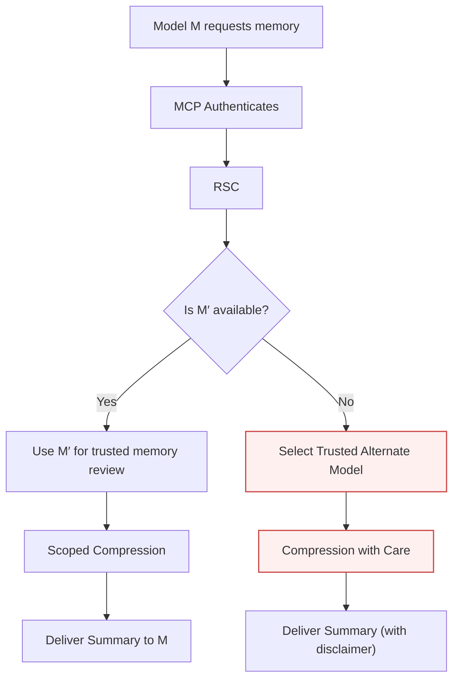

```mermaid
flowchart TD
  M[Model M requests memory] --> Auth
  Auth[MCP Authenticates] --> RSC
  RSC --> CheckModel{Is M′ available?}
  
  CheckModel -- Yes --> SameModel[Use M′ for trusted memory review]
  SameModel --> Compress[Scoped Compression]
  Compress --> Deliver[Deliver Summary to M]

  CheckModel -- No --> Delegate[Select Trusted Alternate Model]
  Delegate --> CompressAlt[Compression with Care]
  CompressAlt --> DeliverAlt["Deliver Summary (with disclaimer)"]

  style Delegate fill:#fff0f0,stroke:#cc4444,stroke-width:1.5px
  style CompressAlt fill:#fff0f0,stroke:#cc4444,stroke-width:1.5px
```