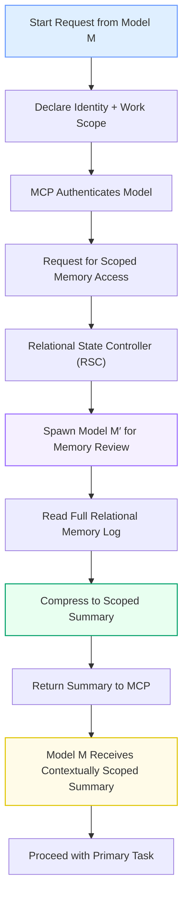

```mermaid
flowchart TD
  A[Start Request from Model M] --> B[Declare Identity + Work Scope]
  B --> C[MCP Authenticates Model]
  C --> D[Request for Scoped Memory Access]
  D --> E["Relational State Controller (RSC)"]
  E --> F["Spawn Model M′ for Memory Review"]
  F --> G[Read Full Relational Memory Log]
  G --> H[Compress to Scoped Summary]
  H --> I[Return Summary to MCP]
  I --> J[Model M Receives Contextually Scoped Summary]
  J --> K[Proceed with Primary Task]
  style A fill:#dfefff,stroke:#6c9cff,stroke-width:1.5px
  style F fill:#f5f0ff,stroke:#9c6cff,stroke-width:1.5px
  style H fill:#e8fff0,stroke:#00a36c,stroke-width:1.5px
  style J fill:#fffbe8,stroke:#e0c600,stroke-width:1.5px
```