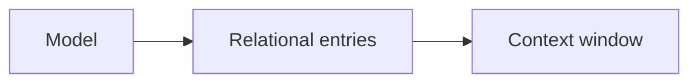
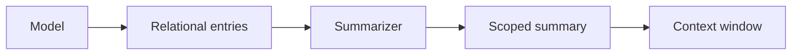
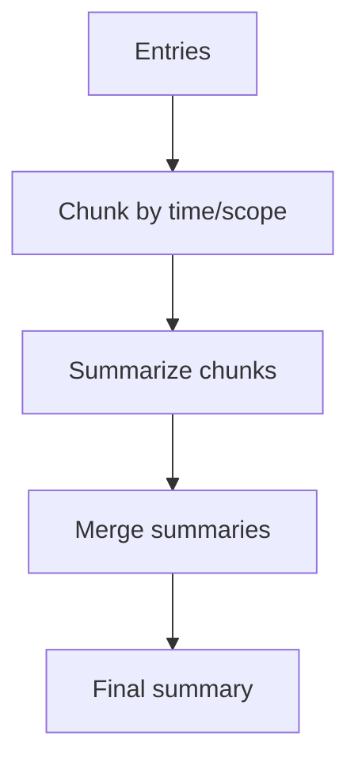
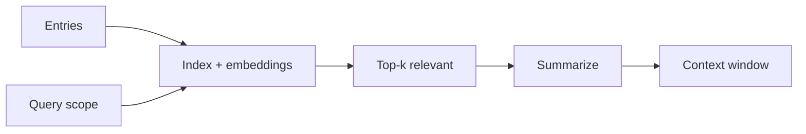

# Memory Summarization Architectures (Pre-Alpha)

This document sketches several summarization/compression approaches, from simple pass-through to more complex, trust-aware pipelines.

## Scenario A: Pass-Through (No Compression)

Pros:
- Maximum fidelity
- Lowest complexity

Cons:
- Hits context limits fast
- No prioritization or dedupe

## Scenario B: Single Summarizer (Scoped Summary)

Pros:
- Simple and effective
- Easy to reason about

Cons:
- Single point of failure
- Loses fine-grained details

## Scenario C: Chunked Map-Reduce Summaries

Pros:
- Scales to long histories
- Preserves coverage across time

Cons:
- Requires chunking strategy
- Risk of summary drift

## Scenario D: Retrieval + Summarize

Pros:
- Focused on relevance
- Efficient for large corpora

Cons:
- Requires embedding/index infra
- Recall depends on search quality

## Scenario E: Multi-Layer Memory (Hot/Warm/Cold)

Pros:
- Balances fidelity and scale
- Easier to keep stable anchors

Cons:
- More orchestration logic
- Needs clear refresh rules

## Scenario F: Evidence-Aware Summaries

Pros:
- Improves trust and traceability
- Enables verification on read

Cons:
- More verbose summaries
- Requires evidence discipline

## Quick Tradeoff Summary
- A is highest fidelity, lowest trust tooling.
- B/C are stable baselines for most teams.
- D/E/F add trust, scale, and traceability at higher complexity.
