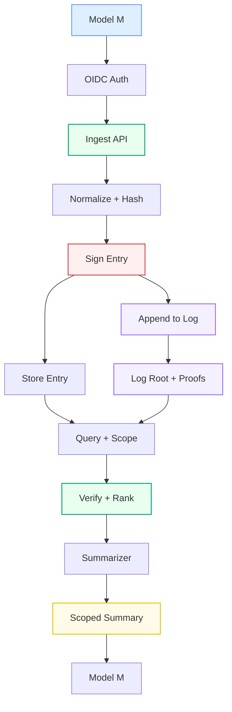
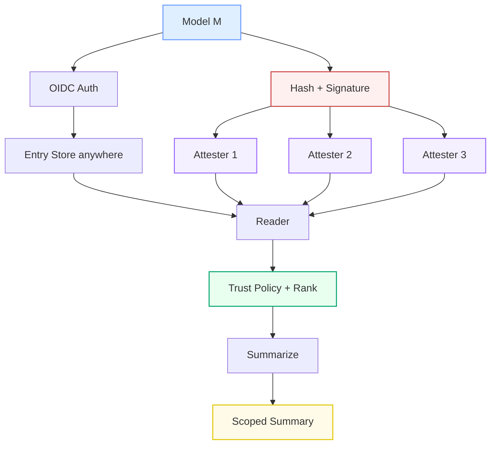
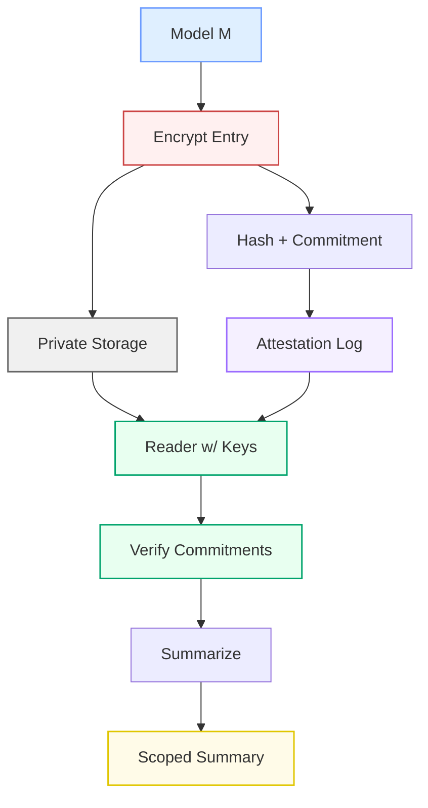

# Relational End-to-End Flows (Pre-Alpha)

These diagrams show the full pipeline: authentication, storage, verification, and summarization.

## Flow A: Central Log + Scoped Summarizer

## Flow B: Distributed Attesters + Retrieval

## Flow C: Encrypted Pointer + Verification + Summarization

Notes:
- Flow A favors simplicity and a single log.
- Flow B distributes trust across multiple attesters.
- Flow C maximizes privacy with encrypted storage and public commitments.
